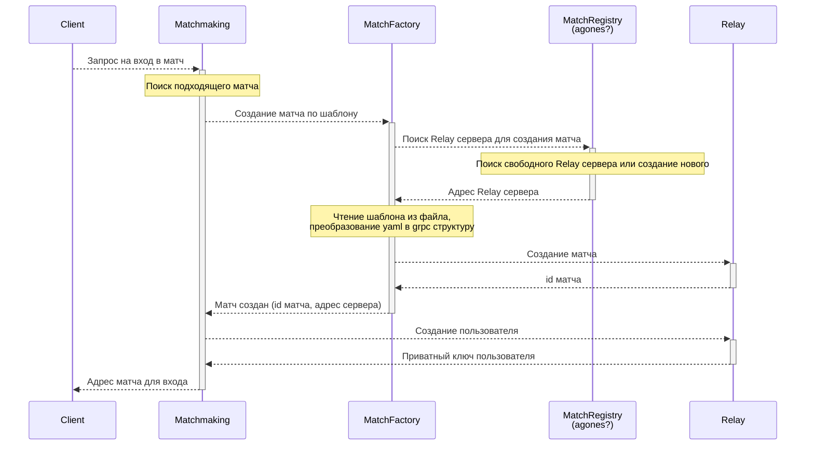

# Компоненты матчей

- Factory - создание матчей на основе шаблона комнат
- Registry - реестр запущенных матчей
- Relay - матч
- StubMatchmaking - простой сервис поиска матчей для пользователей (только для тестирования)
- StubRegistry - простой реестр запущенных матчей (только для тестирования)

## Взаимодействие

- MatchFactory - читает yaml файл с конфигурацией шаблона матча, преобразует его в grpc вызовы для Relay
- MatchRegistry - хранит список запущенных матчей и relay серверов, обеспечивает создание новых экземпляров
  по-необходимости.
- Relay - сервер для проведения матча между пользователями.

