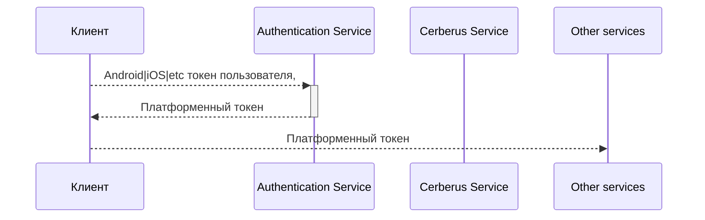

# Accounts

- Создание и обновление JWT токена для авторизации внутри платформы;
- все данные сохраняются в Redis;
- сервисы проверяют валидность токенов самостоятельно, без обращений;
  внешние сервисы и базы данных;
- используется Session и Refresh токены;



## Клиент
- games.cheetah.accounts


## Время жизни токенов

Задаются константами в файле. Так как время жизни записывается в токене, то новые значения будут применены только для
новых токенов. Так как session токены нельзя отозвать, то время его действия не должно превышать пары часов, в идеале
10-15 минут. Refresh токены отозвать можно, однако на данный момент такой команды у сервиса нет.

## Library

Библиотека для валидации токена. Используется в других микросервисах для получения идентификатора пользователя из
токена, а также для проверки валидности токена.

## Генерация ключей

```shell
openssl ecparam -name prime256v1 -genkey -out private.pem
openssl pkcs8  -topk8 -nocrypt -in private.pem -out private-pkcs8.pem 
openssl ec -in private.pem -pubout -out public.pem
cat private-pkcs8.pem | base64 
cat public.pem | base64
```
